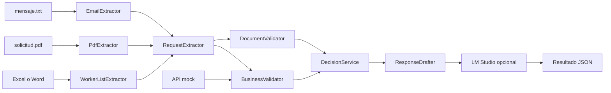

# Tramitación de solicitudes de formación

He preparado este prototipo para el caso práctico de solicitudes de inscripción en acciones formativas. Lee el correo, el PDF y el listado de trabajadores; consulta el sistema de gestión simulado; y deja una propuesta clara: aprobar, pedir documentación, denegar o revisar manualmente.

La idea era dedicar el tiempo a un flujo pequeño, ejecutable y fácil de explicar. Por eso automatizo los casos claros y aparto los que tienen documentos incompletos, datos que no cuadran o requieren interpretación. No pretende ser un producto de producción ni procesar documentos distintos de los que venían en el ejercicio.

## Resultado con el lote entregado

Procesé las 40 solicitudes contra la API mock usando el modo de simulación, de modo que no se crearon inscripciones durante esa prueba.

| Decisión | Solicitudes |
|---|---:|
| Aprobadas | 13 |
| Documentación pendiente | 5 |
| Denegadas | 9 |
| Revisión humana | 13 |
| Total | 40 |

Los JSON de esa ejecución están en [output/](output/) y el resumen en [output/summary.json](output/summary.json).

También probé el registro real de forma aislada con `SOL-2026-0004`: la API mock creó tres inscripciones y la consulta posterior las devolvió. Reinicié el servidor después para no alterar el resto de pruebas.

## Qué devuelve el programa

Cada expediente incluye:

1. Los datos encontrados en el correo, PDF y listado, junto con su fuente.
2. Las incidencias documentales y de negocio detectadas.
3. Una decisión: `approve`, `request_documents`, `deny` o `human_review`.
4. Un borrador de respuesta para la empresa.
5. El resultado de la simulación de registro, o del registro real si se ha pedido expresamente.

No envío correos. Para las aprobadas, el comportamiento normal es validar el registro con la API sin guardar nada. La escritura real requiere `--register`.

## Estructura esperada

Dejé el proyecto y la carpeta original del caso al mismo nivel, así no duplico los documentos entregados:

```text
Interviews/
├── awakelab-solicitudes-v2/
│   ├── src/awakelab_solicitudes/
│   │   ├── extractors/
│   │   └── services/
│   ├── tests/
│   ├── output/
│   ├── README.md
│   └── DECISIONES.md
└── caso-solicitudes-documentales/
    ├── solicitudes/
    ├── datos/
    └── mock_api/
```

Las rutas buscan la carpeta hermana `../caso-solicitudes-documentales/`. No hace falta copiar `solicitudes`, `datos` ni `mock_api` dentro de este proyecto.

## Ejecutarlo

### 1. Preparar el entorno

```powershell
Set-Location C:\Users\Joel\Desktop\Work\Interviews\awakelab-solicitudes-v2
```

```powershell
uv sync
```

### 2. Arrancar la API simulada

En una primera terminal:

```powershell
uv run python ..\caso-solicitudes-documentales\mock_api\servidor.py
```

La API queda disponible en `http://127.0.0.1:8092`.

### 3. Ejecutar una solicitud

En una segunda terminal:

```powershell
uv run python -m awakelab_solicitudes.extract SOL-2026-0004
```

Ese comando muestra el JSON completo. Para una demo, `--brief` es más cómodo: enseña los archivos usados, incidencias, decisión, borrador y registro sin imprimir todos los campos extraídos.

```powershell
uv run python -m awakelab_solicitudes.extract SOL-2026-0004 --brief
```

### 4. Procesar las 40 solicitudes

```powershell
uv run python -m awakelab_solicitudes.batch
```

Crea un JSON por solicitud y un `summary.json` dentro de `output/`. Por defecto, las aprobadas se validan con `POST /inscripciones?simular=1`: la API comprueba el payload pero no escribe nada.

Para registrar de verdad en la API mock:

```powershell
uv run python -m awakelab_solicitudes.batch --register
```

## Flujo



El orden es: extraer los documentos, comparar los datos, consultar la API, aplicar las reglas y preparar el borrador.

## Extracción y reglas

El parser está adaptado a los formatos del ejercicio:

| Fuente | Información | Comportamiento |
|---|---|---|
| Correo `mensaje.txt` | Empresa, CIF si aparece, contacto, email, acción y participantes declarados | Lee los dos formatos de correo entregados. |
| PDF legible | Empresa, CIF, contacto, email, teléfono, acción, curso, modalidad, participantes y fechas | Lee las etiquetas del formulario SIF-03. |
| PDF escaneado | Estado `scanned` | Se deriva a revisión humana; no monté OCR. |
| Excel | DNI, nombre, categoría y horas | Lee las cinco columnas de los 33 Excel. |
| Word | DNI, nombre, categoría y horas | Lee la tabla de los tres Word. |

Cada campo mantiene `value`, `source` y `location`. Cuando dos documentos se contradicen, se puede ver rápidamente dónde se encontró cada dato.

Las reglas documentales y las reglas de negocio están separadas. El detalle está en [DECISIONES.md](DECISIONES.md).

| Incidencia | Resultado |
|---|---|
| PDF escaneado | Revisión humana. |
| Falta el listado de trabajadores | Pedir documentación. |
| DNI con letra de control incorrecta | Pedir que corrijan el listado. |
| Correo, PDF o listado se contradicen | Revisión humana. |
| Empresa no registrada o no al corriente | Denegar. |
| Acción inexistente, cerrada o sin plazas | Denegar. |
| Trabajador ya inscrito | Denegar. |
| Sin incidencias | Aprobar. |

Las decisiones se toman con reglas deterministas. Un LLM no aprueba, deniega ni modifica las validaciones.

## Registro

Solo las solicitudes con decisión `approve` llegan al registro. El payload usa el CIF y la acción del PDF y los DNI del listado.

| Modo | Comando | Qué ocurre |
|---|---|---|
| Simulación | `uv run python -m awakelab_solicitudes.extract SOL-2026-0004` | Comprueba el payload sin guardar inscripciones. |
| Registro real en la API mock | `uv run python -m awakelab_solicitudes.extract SOL-2026-0004 --register` | Crea la inscripción en la API simulada. |

La salida siempre incluye una sección `registration`. Los casos que no se aprueban quedan como `skipped` y no realizan un POST de escritura.

## Para qué usé LM Studio

La decisión se toma antes de llamar al modelo. LM Studio recibe únicamente la decisión, sus motivos y el borrador de plantilla; solo tiene que devolver un asunto y un cuerpo más claros en español. El prompt le prohíbe inventar datos o cambiar la decisión.

Por defecto uso una plantilla y el resultado aparece como `"source": "template"`. Para activar un modelo local, hay que arrancar el servidor de LM Studio y cargar un modelo de instrucciones:

```powershell
uv run python -m awakelab_solicitudes.extract SOL-2026-0004 --lm-studio
```

Si hay varios modelos cargados:

```powershell
uv run python -m awakelab_solicitudes.extract SOL-2026-0004 --lm-studio --model "your-model-id"
```

También se puede usar en lote:

```powershell
uv run python -m awakelab_solicitudes.batch --lm-studio
```

La conexión es local, mediante la API compatible con OpenAI de LM Studio en `http://127.0.0.1:1234/v1`. Si no está disponible, tarda demasiado o devuelve algo inválido, el programa conserva la plantilla y guarda el error en `refinement_error`. El procesamiento no queda bloqueado. La referencia de la API está en [LM Studio OpenAI compatibility](https://beta.lmstudio.ai/docs/developer/openai-compat).

## Pruebas

Las pruebas no necesitan arrancar ni la API mock ni LM Studio:

```powershell
uv run pytest tests
```

Cubren la extracción de correo, PDF y listados; las validaciones; decisiones; borradores; fallback de LM Studio; y el resumen del lote.

Para la comprobación manual usaría estos casos:

| Caso | Qué enseña |
|---|---|
| `SOL-2026-0004` | Caso limpio: extracción, validaciones y aprobación. |
| `SOL-2026-0001` | CIF distinto entre correo y PDF. |
| `SOL-2026-0002` | Número de trabajadores distinto entre PDF y listado. |
| `SOL-2026-0005` | PDF escaneado y listado ausente. |

## Código

| Archivo | Responsabilidad |
|---|---|
| `extractors/email.py` | Lee `mensaje.txt`. |
| `extractors/pdf.py` | Lee el formulario PDF legible. |
| `extractors/worker_list.py` | Lee el Excel o Word de trabajadores. |
| `services/api.py` | Consulta y registra en la API mock. |
| `services/validation.py` | Comprueba la coherencia de documentos. |
| `services/business_validator.py` | Comprueba empresa, acción, plazas e inscripciones. |
| `services/decision.py` | Convierte incidencias en una decisión. |
| `services/responses.py` | Crea el borrador y llama a LM Studio si se pide. |
| `services/registration.py` | Simula o registra las aprobadas. |
| `services/lm_studio.py` | Cliente local de LM Studio y fallback. |
| `batch_processor.py` | Recorre el lote y crea el resumen. |

## Límites que dejé explícitos

El flujo funciona para las 40 solicitudes proporcionadas: lee 32 PDF con texto, 33 Excel y 3 Word; identifica 8 PDF escaneados y 4 listados ausentes; consulta la API mock; y deja una decisión y un borrador por caso.

No añadí envío de correos, OCR ni compatibilidad con formatos nuevos. Son decisiones de alcance para no complicar un prototipo de unas horas. LM Studio es opcional y las pruebas usan clientes simulados, por lo que no dependen de GPU ni de un modelo cargado. La API mock usa datos ficticios; en producción separaría secretos, permisos y credenciales de servicio.

## Antes de producción

Antes de automatizar de verdad, aclararía estas reglas:

1. Si correo, PDF y sistema discrepan, ¿qué fuente prevalece?
2. ¿Qué errores se pueden denegar automáticamente y cuáles debe revisar una persona?
3. ¿Una inscripción previa bloquea siempre o se puede ampliar?
4. ¿Cuándo se reservan plazas: recepción, aprobación o registro?
5. ¿Qué datos personales se conservan, por cuánto tiempo y quién accede?
6. ¿Qué ocurre si falla la integración en pleno registro?

Mediría las solicitudes resueltas sin intervención, revisiones humanas por motivo, decisiones incorrectas detectadas, tiempo de tramitación, fallos de la API, errores por tipo de documento y los fallback del LLM.

## Si tuviera que escalarlo en AWS

Este prototipo lee archivos locales y los procesa uno a uno. Con una base de datos de un millón de registros, separaría documentos, estado y procesamiento:

- Adjuntos en almacenamiento de objetos y resultados en una base de datos.
- Una cola para extracción, validación y registro asíncronos.
- Registros idempotentes para que un reintento no duplique inscripciones.
- Límites de concurrencia y reintentos controlados con servicios externos.
- Datos personales, auditoría y borradores con permisos y retenciones separados.
- Logs estructurados, métricas, alertas y una bandeja de revisión humana.

No monté esa infraestructura porque primero quería validar el flujo de negocio y las decisiones que habría que conservar al escalar.

## Guion de demo de diez minutos

1. Enseñar los tres documentos de una solicitud y explicar qué extrae cada parser.
2. Ejecutar `SOL-2026-0004 --brief` como ejemplo de aprobación limpia.
3. Ejecutar `SOL-2026-0005 --brief` para enseñar el tratamiento de un escaneado y un listado ausente.
4. Abrir `output/summary.json` y comentar el resultado del lote.
5. Explicar por qué la decisión es determinista y LM Studio solo interviene en el texto.
6. Cerrar con los límites del prototipo y cómo lo plantearía en AWS.
